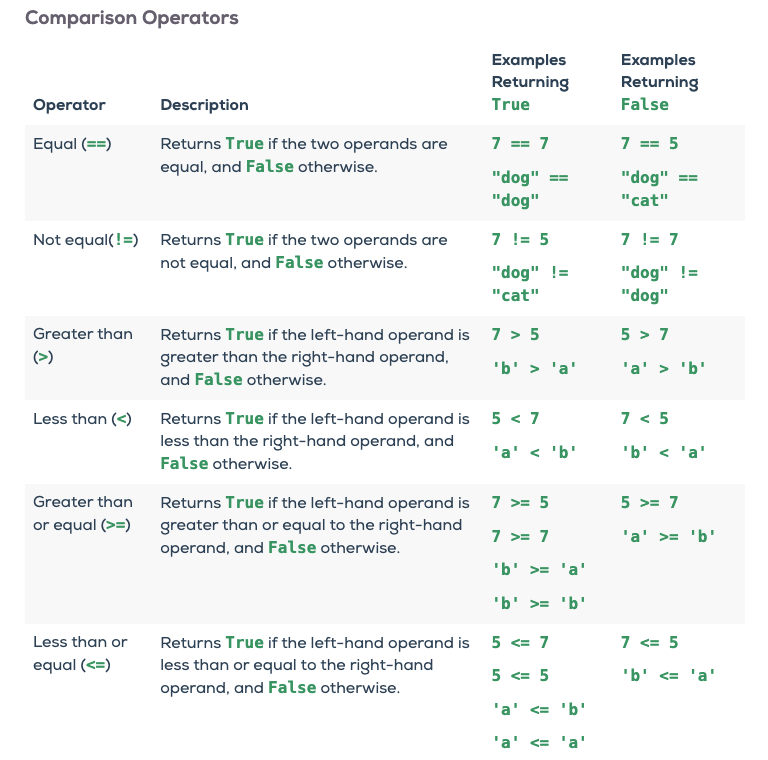

# Chapter 5: Making Decisions With Conditionals
## Booleans
* An important core feature of any programming language is the ability to handle conditional logic
  * Conditional logic allows you to empower your code with the capability to reason based on pre-defined logic
  * ie:
    * If this is true then do this
    * If this is not true do this instead
### Booleans Values
* The `boolean` data type is meant for storing two values:
  1. `true`
  2. `false`
     * In C# boolean values are `case-sensitive`
       * These **are** valid: `true` or `false`
       * These **are not** valid: `True` or `False`
* The `true` and `false` values **are not** `strings`
```C#
Console.WriteLine(true);
// Outputs: True

Console.WriteLine(true.GetType());
// Outputs: System.Boolean

Console.WriteLine(false.GetType());
// Outputs: System.Boolean
```
### Boolean Conversion
* The `boolean` type also has a conversion function:
  * `Convert.ToBoolean()`
    * It is similar to the `Int32.Parse()` and `Double.Parse()` methods
      * This is super limited and is rarely used
        * Use-case would be if you are accepting user input that explicitly expects the words `true` or `false`
* `Try it!` section results:
```C#
Console.WriteLine(Convert.ToBoolean("true"));
// Outputs: True

Console.WriteLine(Convert.ToBoolean("TRUE"));
// Outputs: True

Console.WriteLine(Convert.ToBoolean(0));
// Outputs: False

Console.WriteLine(Convert.ToBoolean(1));
// Outputs: True

Console.WriteLine(Convert.ToBoolean(-1));
// Outputs: True

Console.WriteLine(Convert.ToBoolean(""));
// Outputs: System.FormatException: String was not recognized as a valid Boolean.
Console.WriteLine(Convert.ToBoolean("LaunchCode"));
// Outputs: System.FormatException: String was not recognized as a valid Boolean.
```
* **Gotchas**:
  * `Int32`: When converting true if value is not zero; otherwise, false
  * `String`: true if value equals [TrueString](https://docs.microsoft.com/en-us/dotnet/api/system.boolean.truestring?view=net-5.0), or false if value equals [FalseString](https://docs.microsoft.com/en-us/dotnet/api/system.boolean.falsestring?view=net-5.0) or null.
    * `TrueString`: Represents the Boolean value true as a string. This field is read-only.
      * Meaning the `string` must be any spelling variation of the string `"true"`
    * `FalseString`: Represents the Boolean value false as a string. This field is read-only.
      * Meaning the `string` must be any spelling variation of the string `"false"`
  * More on how this method works with other data types can be found [here](https://docs.microsoft.com/en-us/dotnet/api/system.convert.toboolean?view=net-5.0#System_Convert_ToBoolean_System_String_)
### Booleans Expressions
* A `boolean expression` is an expression that evaluates to either `True` or `False`
* The `equality operator` `==` is able to compare two values and returns a `true` or `false`

```C#
Console.WriteLine(5 == 5);
// Outputs: True
Console.WriteLine(5 == 6);
// Outputs: False
```
#### Comparison Operators
* The `==` is one of six common `comparison operators`

## Logical Operators

### Boolean Operators
#### Logical AND
#### Logical OR
#### Logical NOT
### Operator Precedence
### Truth Tables

## Conditionals
### if Statements
### else Clauses
### else if Statements

## Nested Conditionals