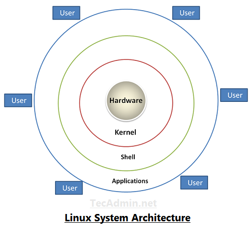

# Chapter 1: Introduction to CLI Shells
## Introduction To CLI Shells
* A computer is made up of hardware and many layers of software
  1. `Computer hardware`: physical and tangible equipment and devices which support your computer's major functions such as input, processing, output, storage, and communication
  2. `Operating System (OS)`: main layer of software which allows human users to interact with a computer
  3. `Kernel`: a computer program which resides within the core of an OS and has complete control over everything in the system
  4. `Shell` is a computer program which exposes an operating system's services to a human user or other program
     * ie: It allows humans to interact with a computer

### What Is A Shell?
* There are two types of `shells` a user can interact with:
 1. `Command-Line Interface`: a command line program that accepts text input to execute operating system functions
    * ie: A Terminal
 2. `Graphical User Interface`: is a system of visual components which convey information about a computer to a user and allow them to interact with it
    * ie: Windows 10, macOS BigSur, macOS Catalina

#### GUI Shells
* `GUI`s allow humans to see a visual indicators that give us the ability to give a computer commands by simulating real word interactions
  * A `GUI shell` is made of of windows and button
    * ie:
      * Pressing the red 'x' closes a window
      * Right clicking your mouse opens a window with a set of options
      * Ctrl + C || Cmd + C copies the text you have highlighted

#### CLI Shell
* A `CLI shell` is also known as a _terminal_
  * They allow humans to interact with a computer via `text-based commands`
  * Rather than having a visual interface to work with a human is able to type commands which the computer in turn can then perform
    * ie:
      * ls: List Files
      * mv: Move File
      * rm: Remove File
      * etc.
    * Keep in mind a `CLI shell` is able to do everything a `GUI shell` can do
      * And you actually have more control over your computer with a `CLI shell` than you do with a `GUI shell`

### Shell Command Languages
* In engineering there is a huge misnomer that is commonly accepted
  * That being the term `Shell` is shorthand for a `CLI shell`
    * The reason for this being a misnomer is what we stated above; a `GIU` and a `CLI` _are both shells_
    * But it is common practice to just call:
      * `CLI shells`: _shells_
      * `GUI shells`: _GUIs_
        * Don't as me why it just is what it is...
* `Shells` (ie: `CLI shells`) use `Command Languages` to run commands
  * ie: the commands we listed in the [CLI Shell](#cli-shell) section above
* Please do not confuse these `Command Languages` with scripting Languages such as _Python_ and _JavaScript_
  * `Command Languages` were created specifically to communicate directly with the computer's OS
* There are hundreds of _shell languages_ but two of the major players are `Bash` and `Powershell`

#### Bash
* `Bash` stands for **B**ourne **A**gain **S**hell
  * `Bash` is a evolution of the original [Bourne Shell](https://en.wikipedia.org/wiki/Bourne_shell) created by [Stephen R. Bourne](https://en.wikipedia.org/wiki/Stephen_R._Bourne)
* There are a few points that you should take away here:
  1. Because Bash is designed to integrate with the Linux OS and Kernel it aligns with the Linux _everything is a file_ descriptor [design](https://dev.to/awwsmm/everything-is-a-file-3oa)