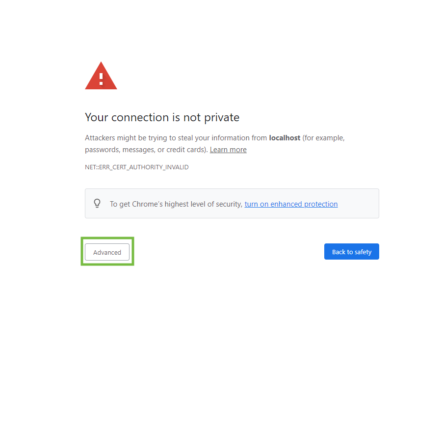
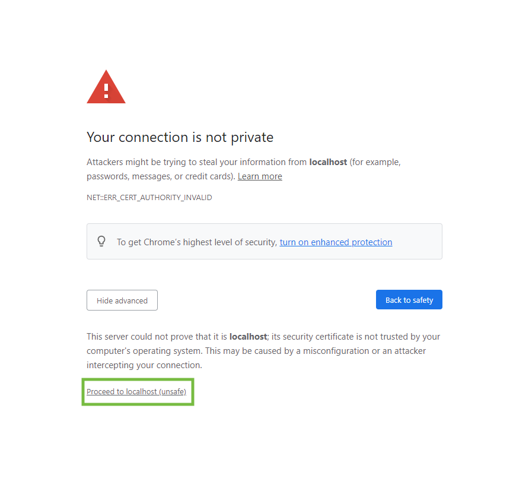
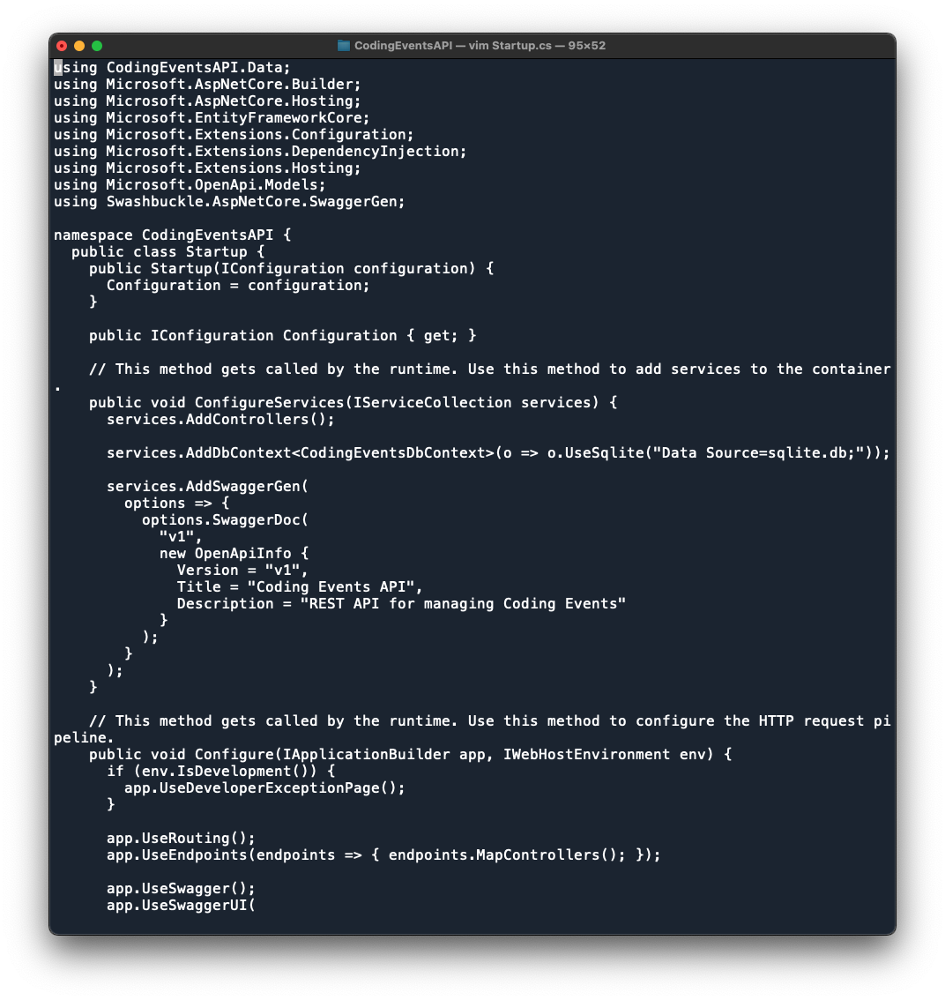
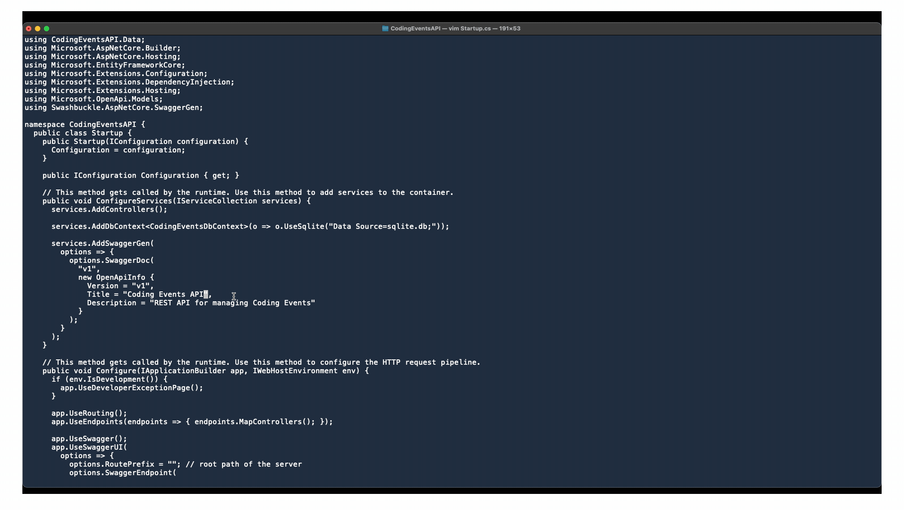

# Chapter 4: Intro To Web Hosting
## Objectives
* In this chapter we will be cover a few topics:
1. `Hosting`
2. `Computer Networking`
3. `Processes & Ports`

* These three topics will give us a surface level understanding of these concepts so that you as engineer can:
  * Understand what hosting is
  * Understand why we need hosting
  * Understand the difference between `local` and `cloud` hosting
  * Have a surface level understand of what `networking` is
    * Be able to talk about some of its core principles
  * Be able to explain what a `server process` is 
  * Be able to ex
## Hosting
## Local Hosting
* Up until now we have been utilizing a `local environment` (ie: `localhost`) to interact with our applications
  * A `local environment` mean you are developing on a computer that you have direct access too
    * ie: your laptop
  * `localhost` is just a alias for the `IP address` of your actual computer
    * More on this in a bit

## Networking
* `Networking` is the process of connecting machines together to communicate information
* _There are two types of `networks`_:
  1. Private Intranets
     * Private networks like your home WiFi
  2. Public Internet

### IP Addresses
* `IP address` stands for _internet protocol address_
  * They are a unique identifier for each computer or device on a network
* All `IP addresses` follow a number pattern of `xxx.xxx.xxx.xxx`
  * Each `x` is a number between _0 and 225_
    * 192.168.0.1
    * 127.0.0.1
    * 255.255.255.255
    * 47.120.14.1
* For this lecture we will only be learning about `IPv4 addresses`
  * There is a new format called `IPv6` but we will not be talking about that in this lecture
  * Both are `IPv4` and `IPv6` are very similar except `IPv6` follows a different numbering format

### Loopback IP Address
* The `loopback` address is `127.0.0.1` or better known by its alias `localhost`
  * It's was designed as a way for engineers to simulate a computer network within a single computer
  * The way we utilize it currently is to simulate a server that hosts our applications while we develop it
    * ie: While we work on a website we need a way to test to see if it functions
    * So when we run our application we need to make it available to our browser in some way
    * We are able to run our application on our local machine by deploying it to the `localhost` and a specific `port`
    * When you run a C# project you are able to access it via `localhost:5001` or `127.0.0.1`

### Local Area Network
* A `Local Area Network` (ie: `LAN`) is a group of devices connected in one location such as an office, school, or even your home
* We use `LAN` to connect computers in a limited area so that they are able to speak to each other
  * One example of this is when you have a computer and a printer in your home, by utilizing the `LAN` option to print a document your computer and printer would not need to by physically connected via a _usb_ cord
* **Note**: A `LAN` can be connected to the `Internet` if it has a actually connection to the public internet
  * More on this in a bit
### Private IP Addresses
* `Private IP Address` is the `IP address` of a individual device within a `LAN`
* Within a network like the one you have at home:
  * All devices within a `LAN` communicate with a `router`
  * The `router` provides `IP addresses` to each device that is connected to it
  * All devices within a `LAN` are able to communicate and identify each other by their `IP addresses`
  * In order for your `LAN` to have _access to the internet_ your `router` must be connected via an `Internet Service Provider` (ISP)
    * ie: Verizon, AT&T, etc.
  * The `ISP` assigns one `public IP address` to your `router`
  * Your `public IP address` is used whenever a device makes a request to the internet
    * Example:
      1. You connect your smartphone to your home wifi network
      2. Your phone is now a part of your home `LAN`
      3. Once connected your `router` assigns your phone a `private IP address`
      4. At this point your phone is able to communicate with any device that is connected to your `LAN`
         * ie: your printer, Roku, FireStick, etc.
      5. Also, now that your phone is connect to the `router` you are able to access websites via the internet
      6. When you use your phone to go to www.google.com you are sending a request via your `router`

### Wide Area Network
* A `WAN` is a network that covers a large geographic area
* `WAN`s are mostly used by 

## Walkthrough: Running Code Anywhere
Provide a short overview of what students will be doing in this walkthrough

### The Dev Side
* For this walkthrough we will be utilizing an optimized version of the _CodingEvents_ application we worked with in the last unit
* This version of the _CodingEvents_ application has been refactored into what is called a `REST Web API`

### The Instructions
#### Initial Setup Of The Coding Events Repo
1. Navigate to the [Coding Events API Repo](https://github.com/launchcodeeducation/coding-events-api)
2. Fork the Repo
3. Clone down the Repo
```sh
# ssh clone link
git clone git@github.com:<YOUR USERNAME>/coding-events-api.git

# https clone link
git clone https://github.com/<YOUR USERNAME>/coding-events-api.git
```
4. `cd` into the cloned directory
```sh
cd coding-events-api/
```
5. Switch to the `1-sqlite` branch
```sh
git checkout 1-sqlite
```
#### Create Your First Release
* In the book they create two different releases:
  1. The first is done with the `dotnet publish -c Release` command
     * This creates a general build which can be ran on _almost_ any system
  2.  The other is done with `dotnet publish -c Release -r linux-x64 -p:PublishSingleFile=true` command
  * Creates a `linux` specific build which user running a _Ubuntu subsystem on a Windows_ machine
* These commands takes all the code you have written and the dependencies that you installed and turns them into executable files that a server can utilize to run your application
* These executable files are stored within a directory called `Release/`
* The `Release` directory is located within a newly created directory called `bin/`
  * Eventually we will take the `Release` directory and place it on a `Azure Cloud Hosting` server so that it is publicly available on the internet
  * For now we will just deploy the `Release` directory locally so that it is accessible over your `LAN` network
* Based on the OS you are using (ie: Mac or Windows) please follow the corresponding steps below
##### Mac Users:
1. To create your first release run the following command inside the _solution directory_
```sh
dotnet publish -c Release
```
##### Window Users: Ubuntu Subsystem
1. To create your first release run the following command inside the _solution directory_: `coding-events-api`
```sh
dotnet publish -c Release -r linux-x64 -p:PublishSingleFile=true
```

#### Run Your Application
* Now that you have created a release for your project you are able to run it locally
* Depending on what OS you are running the next step will differ:

##### Mac Users:
1. `cd` to the _project directory_: `CodingEventsAPI/`
```sh
cd CodingEventsAPI/
```
2. Run your application with the following command:
```sh
dotnet ./bin/Release/netcoreapp3.1/publish/CodingEventsAPI.dll
```
* At this point the application should be listening at `localhost:5001`
 * This is a different instances then the one that run when you execute `dotnet run`

##### Window Users: Ubuntu Subsystem
1. `cd` to the _project directory_: `CodingEventsAPI/`
```sh
cd CodingEventsAPI/
```
2. Run the following command
```sh
./bin/Release/netcoreapp3.1/linux-x64/publish/CodingEventsAPI
```
* At this point the application should be listening at `localhost:5001`
 * This is a different instances then the one that run when you execute `dotnet run`
* If you navigate to `localhost:5001` via your browser you will probably see the following error message: _Your connection is not private_
* You receive this error due to the site is deployed via `http`
* To see your site:
  1. Click the _Advanced_ button:

  2. Click the _Proceed to localhost (unsafe)_ button

## Studio: Deploying & Connecting to a Machine on the Same LAN
* Students will need to use either Nano or Vim to change the code in `CodingEventsAPI/Startup.cs`

### The Development Machine
* For _Window users_ who are utilizing the `Ubuntu Subsystem` you will be unable to open the project you cloned down via a IDE (ie: Visual Studio, VS Code) you are familiar with due to the fact that you have not installed one on the subsystem and you are running a `headless` subsystem
* But luckily most systems (Windows, Mac OS, Linux) have come with two terminal text editors:
  1. [Vim](https://www.vim.org/) - an advanced text editor that seeks to provide the power of the de-facto Unix editor 'Vi', with a more complete feature set.
  2. [Nano](https://www.nano-editor.org/) - a simple editor, inspired by Pico
* The first step the book ask you to do is edit the `CodingEventsAPI/CodingEventsAPI.csproj` file sense you are unable to open it via a IDE we will be using a terminal text editor for this example we will be using `Vim`

#### Vim Ground Rules
* Vim does not operate like the IDEs you are used to working with
* I am going to provide you with exact instructions to accomplish the task of editing the `Startup.cs` file
* With that said `Vim` is a SUPER powerful tool and when used properly can increase your productivity significantly
* If you would like to learn more on how to use `Vim` please see this great article by [freeCodeCamp: Vim Editor Modes Explained](https://www.freecodecamp.org/news/vim-editor-modes-explained/)
#### Editing the Startup.cs File: Vim
1. Open a terminal and navigate to the `coding-events-api/CodingEventsAPI` directory
2. Once there open the `Startup.cs` file inside `Vim`
```sh
vim Startup.cs
```
3. At this point you will see the entire `Startup.cs` file inside of your terminal!

4. Use the `down arrow` key to move your cursor down to the line that contains the following code: `Title = "Coding Events API"` then use the `right arrow` to move to the end of the line

5. Next we need to enter the `Insert Mode` which allows us to insert text
   * Press the `i` key and you will see that `-- INSERT -- ` appears at the _bottom left corner of the terminal_
   * At this point you are able to edit the code in your file
   * Delete the `Coding Events API` text and replace it with your name

9. Next is to save your changes
   * Hit the `esc` button twice
   * You will see that the `-- INSERT -- ` is removed from the _bottom left corner_
   * Next we need to save our changes to do this just type: `:wq`
   * This will close save your changes and close `Vim`

## Summary
Provide definitions to keywords that were provided throughout the lesson
Also provide short explanations to the lecture objectives

### Resources
* [What is localhost? - by: What Is My IP Address](https://whatismyipaddress.com/localhost)
* [Understanding the Loopback Interface - by: Juniper](https://www.juniper.net/documentation/en_US/junos/topics/concept/interface-security-loopback-understanding.html)
* [What is a LAN? - by: CISCO](https://www.cisco.com/c/en/us/products/switches/what-is-a-lan-local-area-network.html)
* [The Difference Between LAN & WAN in Wireless Router - by: HypertecDirect](https://hypertecdirect.com/knowledge-base/the-difference-between-lan-wan-in-wireless-routers/)